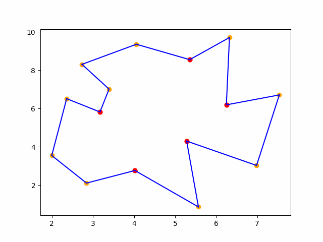

# 2D Triangulation

## Authors
- Jan Chadziński
- Emil Żychowicz

## Project Overview
This project presents a comparative implementation and analysis of two polygon triangulation algorithms: the Delaunay triangulation algorithm and the monotone polygon decomposition method. Detailed descriptions of the implementations and algorithm specifics can be found in the accompanying documentation.

Implementation and algorithms details are described in documentation.

## Key features
- Dual Triangulation Algorithms: Triangulate any simple polygon using either the Delaunay method or by decomposing it into monotonic polygons.
- Performance Comparison: Evaluate both algorithms based on computational time and the quality of the triangulation.
- Basic animation-maker with matplotlib.
- Valid polygon generator.
- Interactive Input.

## Key files
- delaunay.py – Implements the Delaunay triangulation algorithm.
- monotonic_division.py – Implements the triangulation algorithm via monotonic polygon decomposition.
- animations.py – Contains the custom animation module for visualizing the triangulation process.

